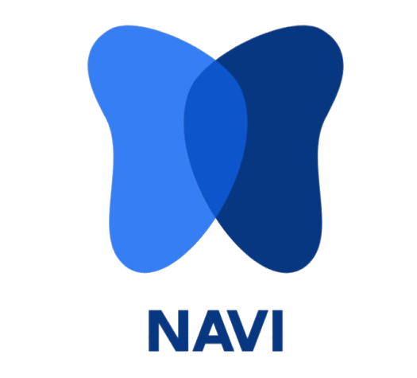
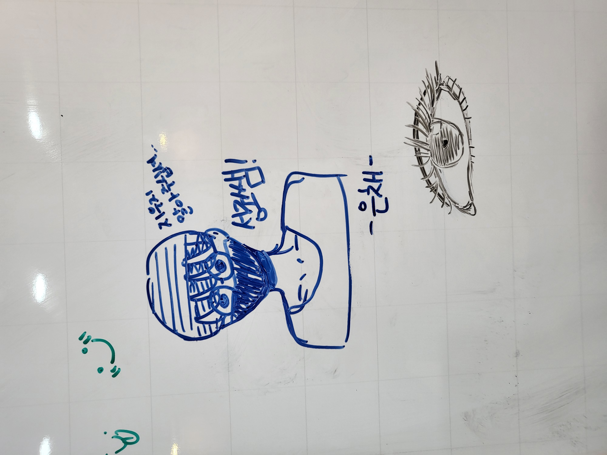
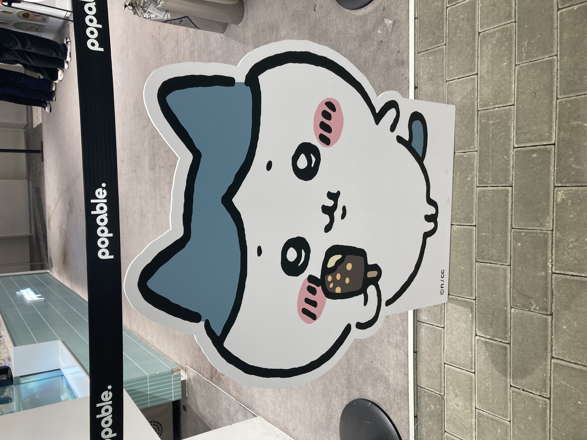
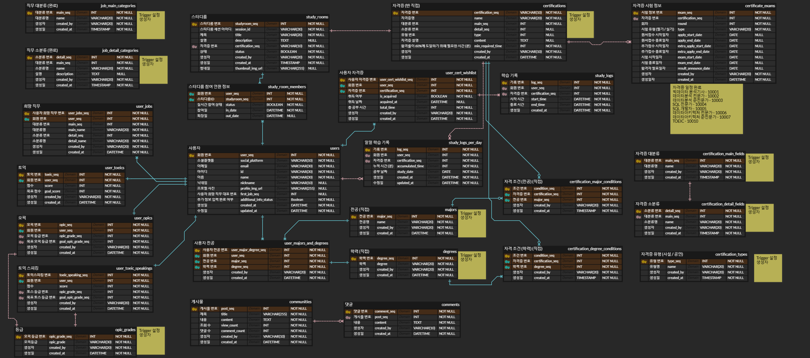

# 프로젝트 개요

<!--  -->
<table>
  <tr>
    <td>
      
    </td>
    <td>
      <b>Navi ( 꿈을 위한 길라잡이 )</b> 
       Navigation + Butterfly
    </td>
  </tr>
</table>

 

## 목차

1. [서비스 소개](#서비스-소개)
2. [팀원 소개](#팀원-소개)
3. [프로젝트 설계 및 구성](#프로젝트-설계-및-구성)  
   3-1. [ERD 및 구조](#데이터베이스-erd)  
   3-2. [사용 기술](#사용-기술)  
   3-3. [주요 기능](#주요-기능)  

 

# 서비스 소개

취업 준비생들의 필수 덕목, **자격증**!  
하지만 취업 준비를 막 시작한 사회 초년생들에게 어떤 자격증이 필요한지, 어떤 직무에서 필요하게 될지 전혀 모르는 경우가 많습니다. 막막한 상황에서 산발적인 정보들을 한 곳에 모아주는 서비스가 있습니다!

**NAVI**는 사용자의 희망 직무에 따라 필요할 자격증들을 추천해줍니다. 목표 자격증을 설정하고 같은 목표를 가진 취준생과 함께 공부할 수 있는 스터디룸까지 제공합니다. 공부 시간을 측정하고, 합격률 예측까지!

**여러분의 꿈을 응원하는 NAVI에서 취업 준비의 한 걸음을 내딛어보세요!**

 

# 🗓 프로젝트 기간

2025.01.06 ~ 2025.02.21

 

#  팀원 소개

<table align="center">
  <tr>
    <td align="center" width="18%;">
      
       <b>홍태휘</b> 
      팀장 
      FE
      
    </td>
    <td align="center" width="18%;">
      
       <b>권희주</b> 
      BE
      
    </td>
    <td align="center" width="18%;">
      
       <b>김성조</b> 
      BE
      
    </td>
    <td align="center" width="18%;">
      
       <b>박수연</b> 
      FE
      
    </td>
    <td align="center" width="18%;">
      
       <b>박해구</b> 
      BE
      
    </td>
    <td align="center" width="18%;">
      
       <b>황석주</b> 
        FE
      
    </td>
  </tr>
</table>

## 세부 역할

<table align="center">
  <tr>
    <td>홍태휘 (팀장)</td>
    <td>추가 정보 입력 페이지, 커뮤니티 페이지</td>
  </tr>
  <tr>
    <td>권희주</td>
    <td>DB 설계, 자격증 검색 및 상세 정보 조회, 추천 알고리즘</td>
  </tr>
  <tr>
    <td>김성조</td>
    <td>Infra, 합격 최소 요구 시간 계산 알고리즘, 사용자 통계 조회</td>
  </tr>
  <tr>
    <td>박수연</td>
    <td>메인 페이지 및 전체적인 디자인</td>
  </tr>
  <tr>
    <td>박해구</td>
    <td>DevOps, 추가 정보 입력, 커뮤니티, 화상 통화</td>
  </tr>
  <tr>
    <td>황석주</td>
    <td>자격증 검색 페이지, 스터디룸 페이지</td>
  </tr>
</table>

 

# 프로젝트 설계 및 구성

## 데이터베이스 ERD

 

## 사용 기술

### 운영체제
---
- **로컬 개발 환경:** 
  
  
- **서버 운영 환경:**

  
  

### IDE & Editor
---
  
  
  

### 버전 & 이슈 관리 및 협업 도구
---
  
  
  
  

### 배포 환경 및 빌드 도구
---
  
  
  
  
  
  
  

  - AWS EC2 (Ubuntu)
  - Nginx
  - Docker ( `27.5.1` ) & Docker Compose ( `v2.32.4` )
  - Jenkins (CI/CD) `2.479.3`
  - Gradle `8.11.1`
  - Npm `9.2.0`

### BackEnd
---
  
  

  
  

  

- JAVA (OpenJDK `17.0.13`)
- SpringBoot `3.3.6`
- Python `3.9.21`
- FastAPI `0.155.8`
- Openvidu `2.31.0`

### FrontEnd
---
  
  

  
  

  
  
  

- TypeScript
- Vue.js (ES6) `3.5.13`
- CSS3
- HTML5
- Tailwind CSS `4.0.1`
- Pinia `2.3.1`
- Axios `1.7.9`

### DB & Storage
---

- MySQL `8.0.4`
- Redis `7.4.2`
- ElasticSearch `8.17.1`
- AWS S3

## API & OpenData

- 한국산업인력공단 Open API

 

## 주요 기능

### 시작 페이지
---
- 소셜 로그인(구글, 네이버, 카카오)

### 메인 페이지
---
- 스크랩 한 자격증 별 합격 최소 요구 시간, 다른 사용자들과의 공부 시간 비교 등 다양한 통계 정보 제공
- 스크랩 한 자격증 시험 일정과 합격 수기, 인기 스터디룸 목록 확인

### 스터디룸 페이지
---
- 자격증 별 스터디룸 목록을 확인할 수 있으며, 원하는 자격증에 대한 스터디룸을 생성하고 참여할 수 있습니다.

### 커뮤니티
---
- 카테고리 별 자격증 합격 수기 및 자유 게시판을 통해 다양한 정보 공유

 
